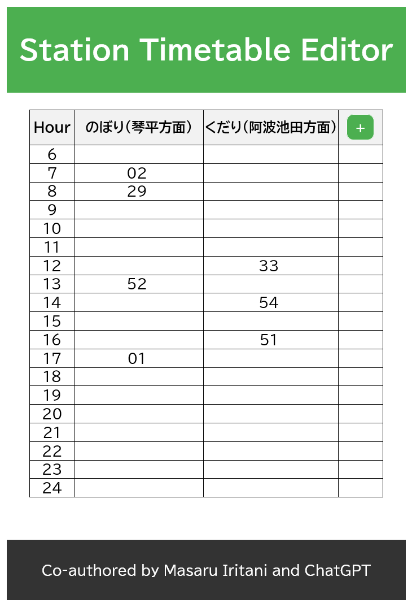

# Station Timetable Editor

## Description
The "Station Timetable Editor" is a Single Page Application (SPA) designed for efficient management and editing of station timetables. This user-friendly application caters to the needs of individuals and organizations managing train or bus station schedules.

## Features

- **Dynamic Timetable Editing**: Users can easily add, modify, and delete time slots in the timetable.
- **User-Friendly Interface**: The application includes interactive elements such as a plus button for adding new time slots and a remove button for deleting unnecessary entries.
- **Accessibility and Responsiveness**: Designed with accessibility in mind, the app ensures a seamless experience across different devices and screen sizes.
- **Real-Time URL Hash Updates**: As changes are made to the timetable, the URL hash updates in real-time, enabling easy bookmarking and sharing of specific timetable states.

## Usage

- **Adding a Time Slot**: Hover near the bottom of the timetable to display the plus button and click it to add a new slot.
- **Editing Time Slots**: Double-click on a timetable cell to edit its contents.
- **Deleting a Time Slot**: Hover near the left border of the last row. If it's empty (except for the first column), a red remove button will appear for deletion.
- **Sharing Timetable States**: Use the dynamically updated URL hash to bookmark or share the current state of the timetable.

## Browser Compatibility
Compatible with modern web browsers like Chrome, Firefox, Safari, and Edge.

## Accessibility
The app is designed with high-contrast elements and a keyboard-navigable interface. Note: Keyboard navigation is currently planned but not yet implemented.

## Project Creation and Updates
This project was generated and periodically updated with the support of ChatGPT. Masaru Iritani created a customized GPT (GPT SPA Coder) to generate and update the codes for this app based on specific instructions and requirements.

## License
This project is licensed under the CC0 License - see the LICENSE.md file for details.

## Contributing
We welcome contributions. Please fork the repository and submit your changes via a pull request.

## Contact
For inquiries or contributions, reach out to the project maintainer at [email@example.com](mailto:email@example.com).

Thank you for using Station Timetable Editor!
